# 生成对抗网络介绍


## 零、本节大纲


## 一、生成对抗网络概述

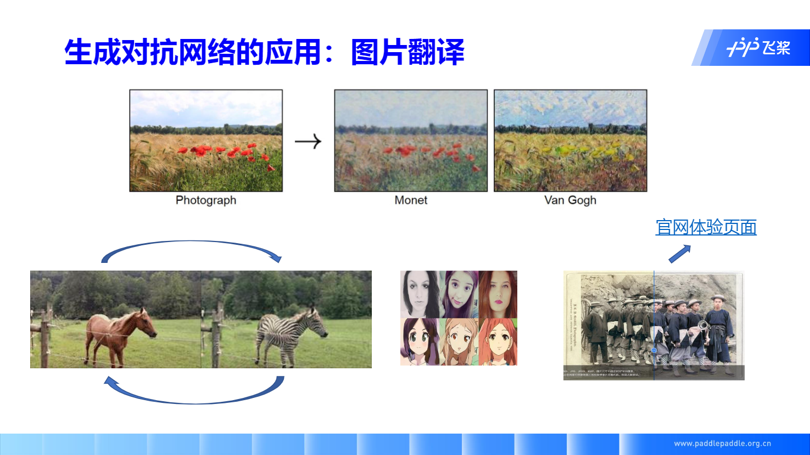


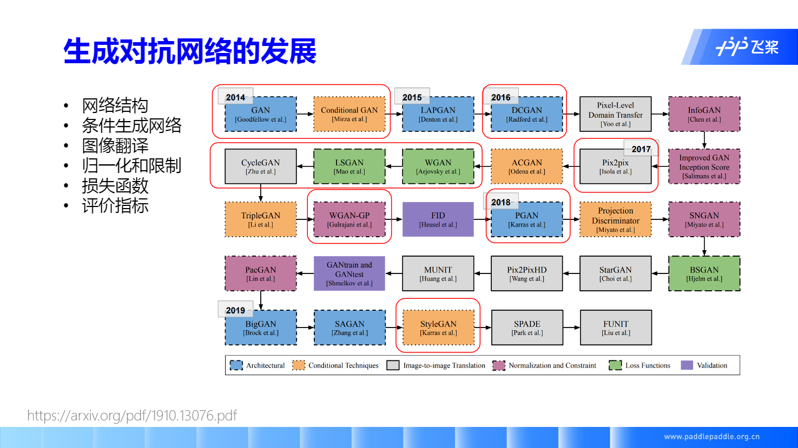

学习过程中应该注意的部分：

1. 网络结构（√）
2. 条件生成网络
3. 图像翻译
4. 归一化和限制
5. 损失函数（√）
6. 评价指标（√）

√ 为学习过程中应该着重注意的部分


## 二、生成对抗网络原理


### 生成对抗网络介绍

生成对抗网络由生成器和判别器构成

- 生成器：希望骗过判别器
- 判别器：希望鉴别生成器生成数据是 fake 的

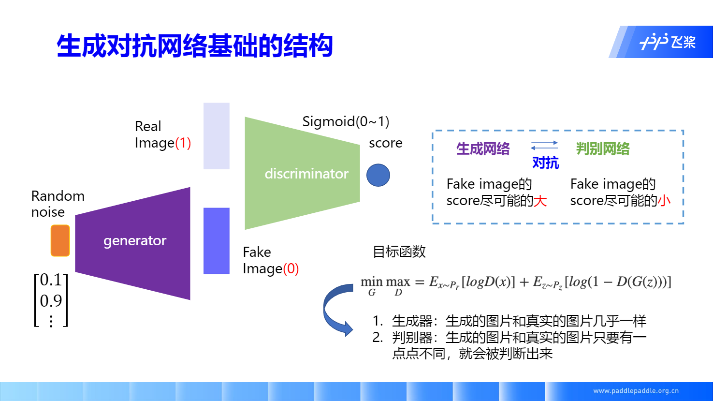

图中假的图片（Fake Image）分数设为 0，真实图片（Real Image）分数设为 1。

看图中目标函数
$$
\min_{G}\max_{D} = E_{x\sim P_r}[\log {D(x)}] + E_{z \sim P_z}[\log (1 - D(G(z)))]
$$
其中

$ x\sim P_r $ 代表 $ x $ 是从真实数据中取出来的，即 $ x $ 满足真实数据分布

$ D(x) $ 即 $ x $ 传入判别器（Discriminator）得到的分数，这里我们会取 log，得到 $ \log {D(x)} $

$ x \sim P_z $ 代表 $ z $ 是从随机噪声中取出来的，即这里得到的 $ z $ 满足随机噪声的分布

$ D(G(z)) $ 代表从随机噪声分布中采样得到的 $ z $ ，通过生成器（Generator），得到生成图片（Fake Image），再通过判别器，最后得到的分数。

**生成器**

对于 生成器，我们先看 $ \min_{G} $

因为

​	通过 $ z $ 生成的图像我们希望它接近真实数据

所以

​	$ z $ 经过判别器得到的分数我们希望它能越大越好

​	同时接近真实数据通过判别器得到的分数，即与 $ D(x) $ 越接近越好。 

​	即课中老师说的 ”生成的图片和真实的图片几乎一样“

**判别器**

对于 判别器，我们看 $ \min_D $

因为

​	我们希望通过 $ z $ 生成的图像能被鉴别器判断出来

所以

​	$ z $ 经过判别器得到的分数我们希望它越小越好

​	同时得到的分数 $ D(z) $ 要与真实数据通过判别器得到的分数 $ D(x) $ 相差越大越好

​	即 ”生成的图片和真实的图片只要有一点点不同，就会被判断出来“


### 生成对抗网络的迭代过程


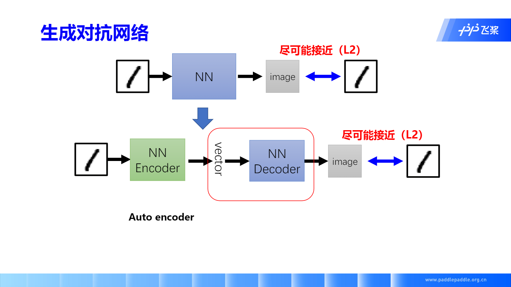

**Autocoder**

原图像通过 Encoder 编码为固定维度的 vector，再通过 Decoder 解码为输入图像尺度相同的图片，并通过计算该图片和原图的 L2 Loss 来使得生成的图尽可能与原图接近。

这样得到的网络，我们取出其中 Decoder 部分，通过调整 vector 能生成图片。

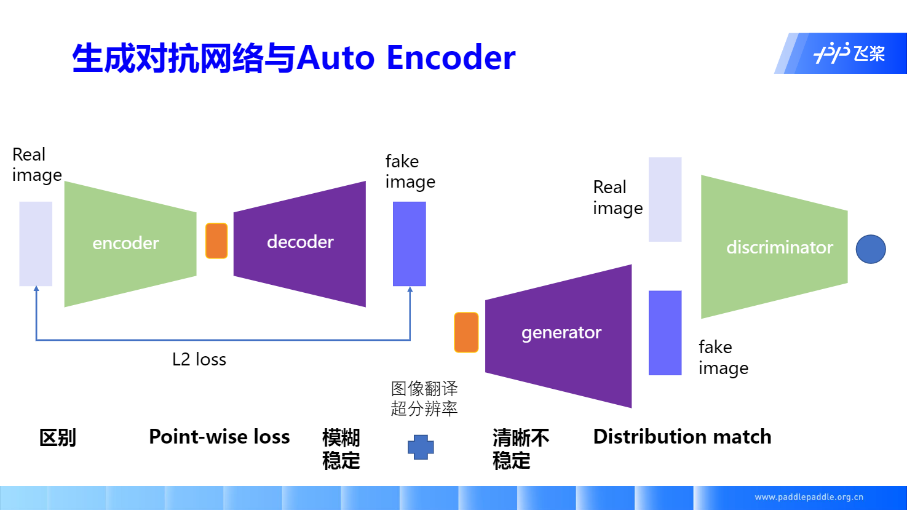


### 生成对抗网络的一点点理论

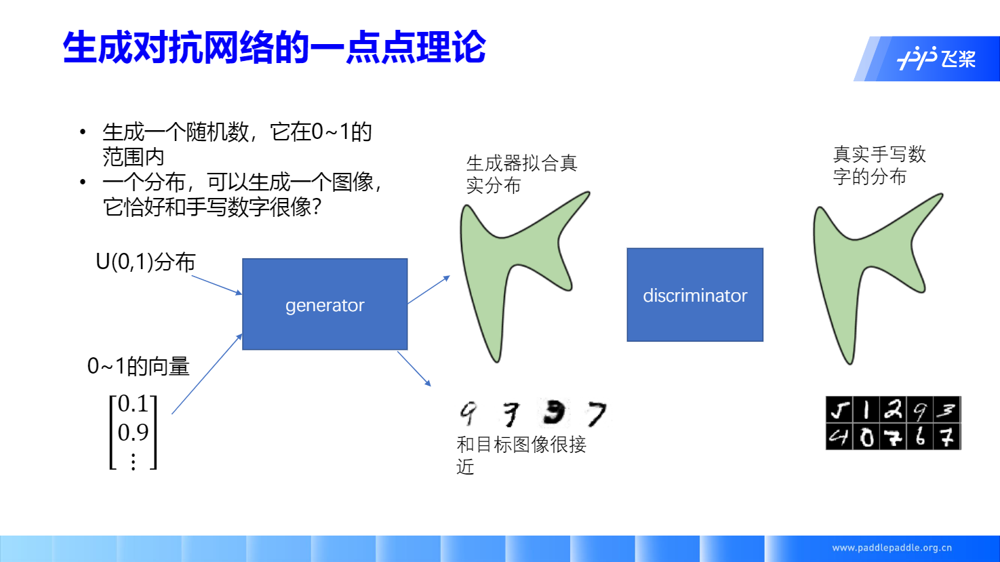

通过采样 [0, 1] 之间的均匀分布，得到一个向量（vector），生成器根据这个向量，去拟合真实分布，从而得到和目标图像接近的生成图像


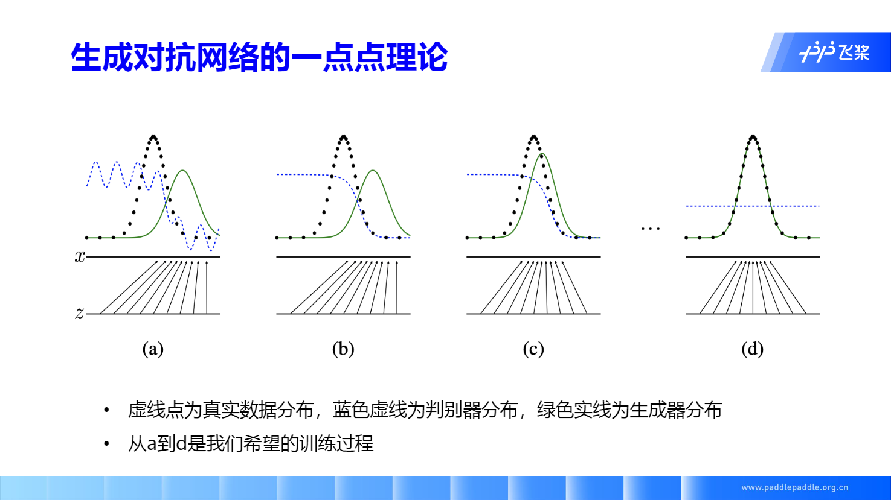

上图是 GAN 训练过程的可视化，可以看到随着参数的更新，我们通过生成器拟合出的数据分布会逐渐向着真实数据接近，并且判别器的分类效果会越来越差并最终为 0.5（ 1 为真实数据得分，0 为生成数据得分），即无法正确判断。

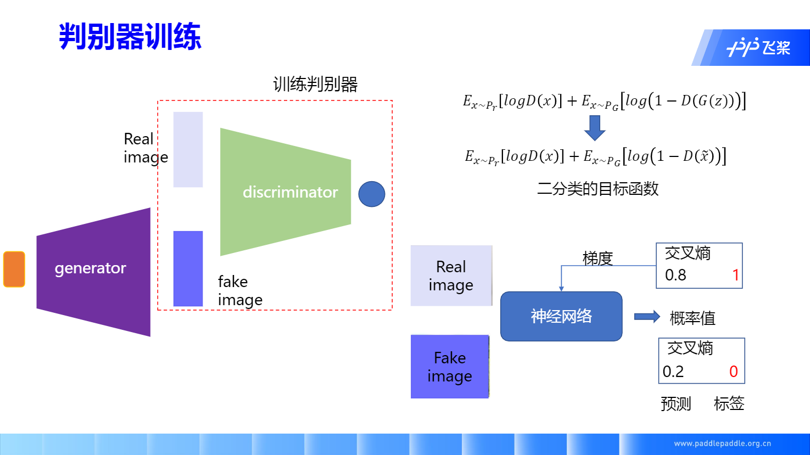

判别器训练可以看作二分类问题，其中  $ \tilde{x} $ 为随机噪声 $ z $ 通过生成器得到的生成图像


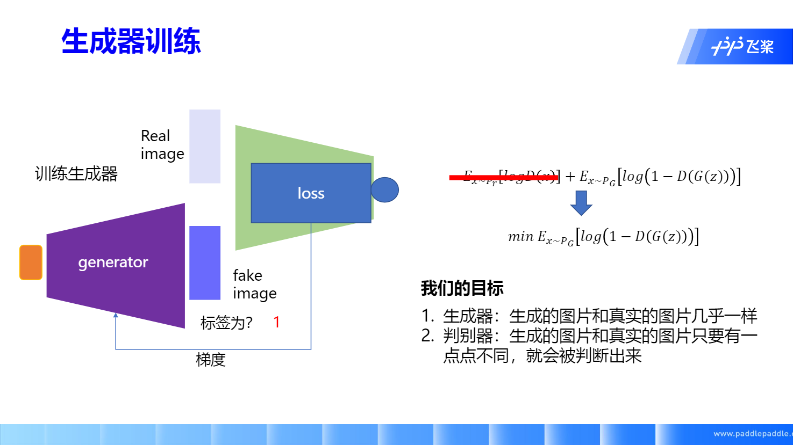

图中红线部分为生成器无关项，即真实图片通过判别器的分数（那我前面就说错了，$ \max_{G} $ 实际上只考虑到了生成图像在判别器的分数，而真实数据这块并没有考虑到 😔）

其中生成图像（fake image）因为期望它能欺骗判别器自己是“真实图像“，所以它的 label 应该为 1。


## 三、DCGAN 代码实践


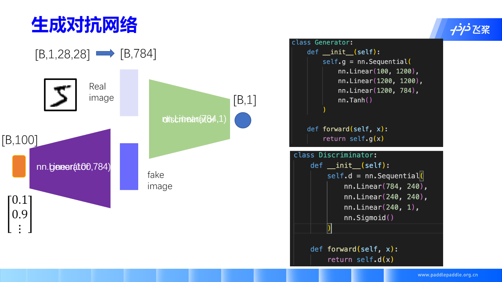

上面是较简单的 GAN 网络代码演示，仅作示例


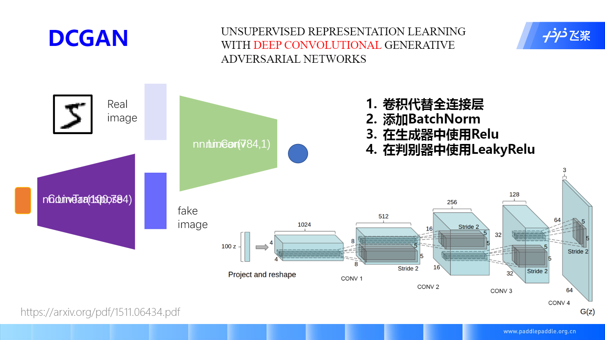


DCGAN = Deep Convolutional GAN（深度卷积 GAN）

左边可能看不清楚，是 ConvTranspose，即可以看作卷积的逆操作，即 [转置卷积][]

改进：

- 卷积代替全连接
- 体检 BatchNorm，防止梯度爆炸、消失、
- 生成器 ReLU
- 判别器使用 LeakyRelu（0.2）


**DCGAN** 代码介绍

我们的 [本课作业][] 就是通过修改 DCGAN 的代码来实现 LSGAN，那在这之前我们先看下 DCGAN 的代码

使用的数据集是 MNIST，手写数字


### 数据预处理

看完数据样式之后，我们会对数据进行一个预处理

```python
dataset = paddle.vision.datasets.MNIST(mode='train', 
                                        transform=transforms.Compose([
                                        # resize ->(32,32)
                                        transforms.Resize((32,32)),
                                        # 归一化到-1~1
                                        transforms.Normalize([127.5], [127.5])
                                    ]))

dataloader = paddle.io.DataLoader(dataset, batch_size=32,
                                  shuffle=True, num_workers=4)
```

先对数据进行一个缩放，使得所图像都变成 (32, 32) 尺寸的图片，因为数字识别对图像清晰度要求不高，所以 32 足以

再就是将图像数据归一化到 [0, 1] 之间，更好收敛（可以看这篇 [归一化][] 文章，里面是我比较赞同的使用归一化原因）

### 参数初始化

```python
#参数初始化的模块
@paddle.no_grad()
def normal_(x, mean=0., std=1.):
    temp_value = paddle.normal(mean, std, shape=x.shape)
    x.set_value(temp_value)
    return x

@paddle.no_grad()
def uniform_(x, a=-1., b=1.):
    temp_value = paddle.uniform(min=a, max=b, shape=x.shape)
    x.set_value(temp_value)
    return x

@paddle.no_grad()
def constant_(x, value):
    temp_value = paddle.full(x.shape, value, x.dtype)
    x.set_value(temp_value)
    return x

def weights_init(m):
    classname = m.__class__.__name__
    if hasattr(m, 'weight') and classname.find('Conv') != -1:
        normal_(m.weight, 0.0, 0.02)
    elif classname.find('BatchNorm') != -1:
        normal_(m.weight, 1.0, 0.02)
        constant_(m.bias, 0)
```

课中绕过了这个部分，实际上参数初始化是根据论文中的经验数值来的，根据 PyTorch 官方的一篇教程讲到的

> From the DCGAN paper, the authors specify that all model weights shall be randomly initialized from a Normal distribution with mean=0, stdev=0.02. The `weights_init` function takes an initialized model as input and reinitializes all convolutional, convolutional-transpose, and batch normalization layers to meet this criteria. This function is applied to the models immediately after initialization.

即模型中的卷积（Conv2）、反卷积（Conv2DTranspose）的参数都用 0 均值 0.02 方差的高斯分布初始化


### 定义生成器

```python
# Generator Code
class Generator(nn.Layer):
    def __init__(self, ):
        super(Generator, self).__init__()
        self.gen = nn.Sequential(
            # input is Z, [B, 100, 1, 1] -> [B, 64 * 4, 4, 4]
            nn.Conv2DTranspose(100, 64 * 4, 4, 1, 0, bias_attr=False),
            nn.BatchNorm2D(64 * 4),
            nn.ReLU(True),
            # state size. [B, 64 * 4, 4, 4] -> [B, 64 * 2, 8, 8]
            nn.Conv2DTranspose(64 * 4, 64 * 2, 4, 2, 1, bias_attr=False),
            nn.BatchNorm2D(64 * 2),
            nn.ReLU(True),
            # state size. [B, 64 * 2, 8, 8] -> [B, 64, 16, 16]
            nn.Conv2DTranspose( 64 * 2, 64, 4, 2, 1, bias_attr=False),
            nn.BatchNorm2D(64),
            nn.ReLU(True),
            # state size. [B, 64, 16, 16] -> [B, 1, 32, 32]
            nn.Conv2DTranspose( 64, 1, 4, 2, 1, bias_attr=False),
            nn.Tanh()
        )

    def forward(self, x):
        return self.gen(x)
```

[Conv2DTranspose][] 的参数可以点击链接看具体作用

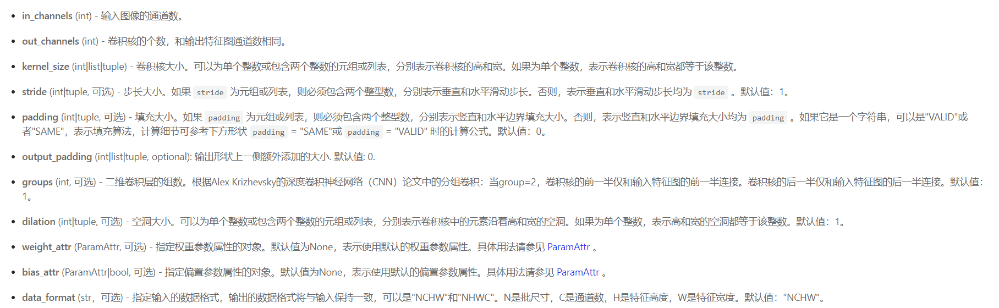

关于输出的图像尺寸如何变化
$$
\begin{align*}
& W_{out} = (W_{in} - 1) \times \text{stride}[1] - 2 \times \text{padding}[1] + \text{dilation}[1]
                        \times (\text{kernel_size}[1] - 1) + \text{output_padding}[1] + 1 \\
& H_{out} = (H_{in} - 1) \times \text{stride}[0] - 2 \times \text{padding}[0] + \text{dilation}[0] \times (\text{kernel_size}[0] - 1) + \text{output_padding}[0] + 1 
\end{align*}
$$


### 定义判别器

```python
class Discriminator(nn.Layer):
    def __init__(self,):
        super(Discriminator, self).__init__()
        self.dis = nn.Sequential(

            # input [B, 1, 32, 32] -> [B, 64, 16, 16]
            nn.Conv2D(1, 64, 4, 2, 1, bias_attr=False),
            nn.LeakyReLU(0.2),

            # state size. [B, 64, 16, 16] -> [B, 128, 8, 8]
            nn.Conv2D(64, 64 * 2, 4, 2, 1, bias_attr=False),
            nn.BatchNorm2D(64 * 2),
            nn.LeakyReLU(0.2),

            # state size. [B, 128, 8, 8] -> [B, 256, 4, 4]
            nn.Conv2D(64 * 2, 64 * 4, 4, 2, 1, bias_attr=False),
            nn.BatchNorm2D(64 * 4),
            nn.LeakyReLU(0.2),

            # state size. [B, 256, 4, 4] -> [B, 1, 1, 1]
            nn.Conv2D(64 * 4, 1, 4, 1, 0, bias_attr=False),
            # 这里为需要改变的地方
            nn.Sigmoid()
        )

    def forward(self, x):
        return self.dis(x)
```


### 定义损失函数和优化器

```python
loss = nn.BCELoss()

# Create batch of latent vectors that we will use to visualize
#  the progression of the generator
fixed_noise = paddle.randn([32, 100, 1, 1], dtype='float32')

# Establish convention for real and fake labels during training
real_label = 1.
fake_label = 0.

# Setup Adam optimizers for both G and D
optimizerD = optim.Adam(parameters=netD.parameters(), learning_rate=0.0002, beta1=0.5, beta2=0.999)
optimizerG = optim.Adam(parameters=netG.parameters(), learning_rate=0.0002, beta1=0.5, beta2=0.999)
```


### 训练过程

```python
losses = [[], []]
#plt.ion()
now = 0
for pass_id in range(100):
    for batch_id, (data, target) in enumerate(dataloader):
        ############################
        # (1) Update D network: maximize log(D(x)) + log(1 - D(G(z)))
        ###########################

        optimizerD.clear_grad()
        real_img = data
        bs_size = real_img.shape[0]
        label = paddle.full((bs_size, 1, 1, 1), real_label, dtype='float32')
        real_out = netD(real_img)
        errD_real = loss(real_out, label)
        errD_real.backward()

        noise = paddle.randn([bs_size, 100, 1, 1], 'float32')
        fake_img = netG(noise)
        label = paddle.full((bs_size, 1, 1, 1), fake_label, dtype='float32')
        fake_out = netD(fake_img.detach())
        errD_fake = loss(fake_out,label)
        errD_fake.backward()
        optimizerD.step()
        optimizerD.clear_grad()

        errD = errD_real + errD_fake
        losses[0].append(errD.numpy()[0])

        ############################
        # (2) Update G network: maximize log(D(G(z)))
        ###########################
        optimizerG.clear_grad()
        noise = paddle.randn([bs_size, 100, 1, 1],'float32')
        fake = netG(noise)
        label = paddle.full((bs_size, 1, 1, 1), real_label, dtype=np.float32,)
        output = netD(fake)
        errG = loss(output,label)
        errG.backward()
        optimizerG.step()
        optimizerG.clear_grad()

        losses[1].append(errG.numpy()[0])


        ############################
        # visualize
        ###########################
        if batch_id % 100 == 0:
            generated_image = netG(noise).numpy()
            imgs = []
            plt.figure(figsize=(15,15))
            try:
                for i in range(10):
                    image = generated_image[i].transpose()
                    image = np.where(image > 0, image, 0)
                    image = image.transpose((1,0,2))
                    plt.subplot(10, 10, i + 1)
                    
                    plt.imshow(image[...,0], vmin=-1, vmax=1)
                    plt.axis('off')
                    plt.xticks([])
                    plt.yticks([])
                    plt.subplots_adjust(wspace=0.1, hspace=0.1)
                msg = 'Epoch ID={0} Batch ID={1} \n\n D-Loss={2} G-Loss={3}'.format(pass_id, batch_id, errD.numpy()[0], errG.numpy()[0])
                print(msg)
                plt.suptitle(msg,fontsize=20)
                plt.draw()
                plt.savefig('{}/{:04d}_{:04d}.png'.format('work', pass_id, batch_id), bbox_inches='tight')
                plt.pause(0.01)
            except IOError:
                print(IOError)
    paddle.save(netG.state_dict(), "work/generator.params")
```


## 四、PaddleGAN 架构

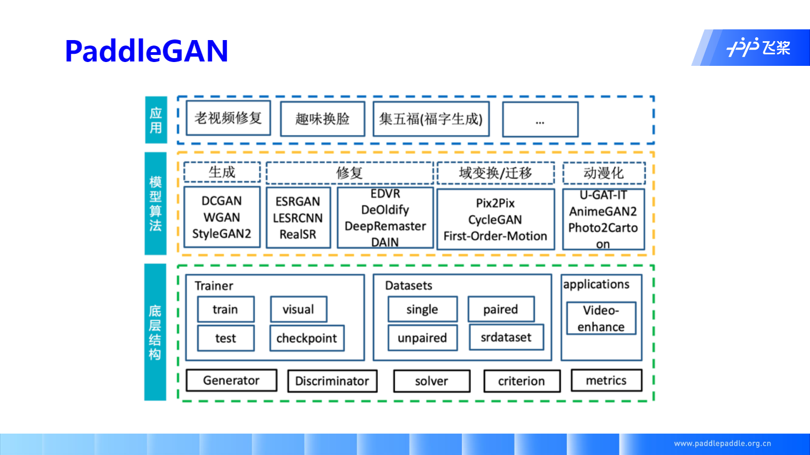

以上是框架介绍

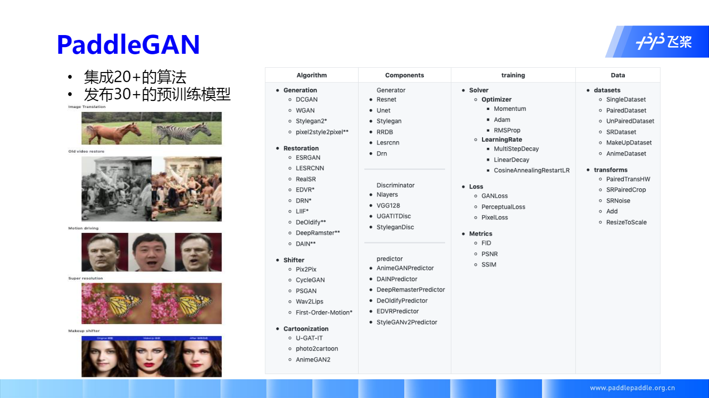

以上是全景图


## 五、番外

在整个深度学习架构中，我们已经学习了 GAN 的简单架构，这里主要关注下 GAN 的 Loss 和 Metrics

### Loss

- GANLoss
- PerceptualLoss
- PixelLoss


#### Metrics

- FID
- PSNR
- SSIM


[本课作业]: https://aistudio.baidu.com/aistudio/projectdetail/1816341?pV=348099	"DCGAN 修改为 LSGAN"

[转置卷积]: https://blog.csdn.net/tsyccnh/article/details/87357447	"转置卷积介绍"
[归一化]: https://www.zhihu.com/question/20455227/answer/197897298	"特征工程中的「归一化」有什么作用？ - 忆臻的回答 - 知乎"
[PyTorch_DCGAN_Tutorial]: https://pytorch.org/tutorials/beginner/dcgan_faces_tutorial.html	"DCGAN TUTORIAL"

[Conv2DTranspose]: https://www.paddlepaddle.org.cn/documentation/docs/zh/api/paddle/nn/layer/conv/Conv2DTranspose_cn.html	"Conv2DTranspose 的文档"

