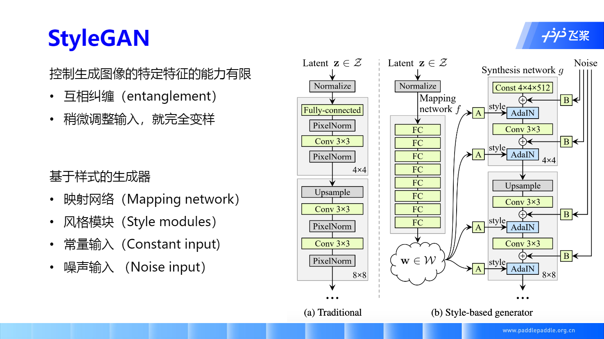

# GAN 的技术演进及人脸生产应用


## 零、本课大纲


## 一、GAN 技术的演技


### GAN 存在的问题


**模式坍塌（多样性）**

如右边人脸，生成模式单一的情况就称为模式坍塌

从数据分布上来看，就是生成器生成数据的分布只是真实数据分布的一部分（参考图中左下）

**训练不稳定**

参考这篇文章 [GAN训练不稳定原因][]


### 目标函数推导


其中关于 $ P_r(x) + P_g(x) $ 怎么变成 2 的推导，我们可以参考 [GAN(一)][]


其中将最后的式子变成了 KL散度，进而变成了 JS散度

关于 KL 散度，可以参考这篇文章 [KL散度的含义与性质][]


整个 KL散度、JS散度，以及后面要提到的 Wassertein距离，参考 [KL散度、JS散度、Wasserstein距离][]


JS 散度存在的问题

- 在训练过程中，数据分布和生成器的分布是不重叠的
- 即使分布存在重合，采样的样本也是大概率不重合的


# GAN 的技术演进及人脸生成应用


### LSGAN


关于使用  LSGAN 的优势，参考这篇文章 [LSGAN][] 以及 paperweekly 的一篇分析 [LSGAN分析][]


### WGAN


上面截断参数的方法没有办法完全满足 *Lipschitz* 限制，WGAN 提出了新的解决方案


我们看一下上图中的 $ E_{x \sim P_{penalty}} $ ，从式子理解是，从 $ P_{penalty} $ 采样得到 $ x $, 并且求得 $ x $ 通过判别器（Discriminator）的分数的梯度（不需要知道 $ x $ 的 label，只需要根据已有的判别器得到的分数求其关于输入 $ x $ 的梯度）。

这个梯度我们希望它在 [-1,1] ，否则会有损失惩罚，即 $ max(0, \left \| \triangledown_{x} D(x) \right \|  -1 ) $ ，因为 $ x $ 从 $ P_{penalty} $ 随机采样，出现概率相同，所以最后求得到的 *penalty* 平均，最后乘以惩罚系数 $ \lambda $


代码如下

> 注：这里 alpha 的生成是满足 [0, 1) 的均匀分布

```python
def gradient_penalty_loss(discriminator, real_data, fake_data):
    """Calculate gradient penalty for wgan-gp"""
    batch_size = real_data.shape[0]
    alpha = paddle.rand([batch_size, 1, 1, 1])
    
    # interpolate between real_data and fake_data
    interpolates = alpha * real_data + (1. - alpha)*fake_data
    
    disc_interpolates = discriminator(interpolates)
    gradients = paddle.grad(
        outputs=disc_interpolates,
        inputs=interpolates,
        grad_outputs=paddle.ones_like(disc_interpolates),
        create_graph=True,
        retain_graph=True,
        only_inputs=True
    )[0]
    
    gradients_penalty = ((gradients.norm(2, dim=1) - 1)**2).mean()
    return gradients_penalty
```

还有网友 [@leigangblog](https://aistudio.baidu.com/aistudio/personalcenter/thirdview/118783) 复现的 WGAN-GP 生成二次元 [WGAN-GP][]

> 关于 gradients_penalty 的代码与式子不同，课上老师解释是因为作者尝试之后觉得  L2 范式 求其与 1 的差值训练效果更好。


## GAN 技术在人脸生成的演进


注意上面时间的变化，以及 GAN 的主要里程碑结构

2014： GAN

2015： DCGAN

2017： PGGAN

2018： StyleGAN

前面关于 GAN 和 DCGAN 我们已经做了学习和了解，接下来我们主要讲解剩下的两个架构， PGGAN 以及 StyleGAN

### PGGAN

如果用 DCGAN 生成分辨率高的图片，会发生什么呢？（如下左图）


相比较 DCGAN，PGGAN 使用了

- WGAN-GP 损失
- 渐进生长（progressive growing）

#### Progressive Growing


按顺序，从左到右从上到下

1. 我们先训练简单的 DCGAN 网络结构，生成较小的图像。
2. 然后在较小图像的基础上，叠加转置卷积层和卷积层，使得现有的 GAN 网络能生成较大的图像，并通过判别器判断该图像是 real 还是 fake，直到能生成满意的 fake image。
3. 重复上述步骤，直到满意尺寸。

具体演示可以参考这个视频 [PGGAN演示视频][]

> 有同学在课上提到转置卷积弊端挺明显，老师也提到我们在真实中并不会使用转置卷积，而是使用 upsample 的方式，即 SegNet 的方法实现

因为上述 第二步 我们再加入新的层时，并不固定之前训练好的层，所以我们需了解之前的层不固定该如何操作。


关于 “smooth fade in” 实际上就是 resnet 的概念，只不过跳跃连接发生在 toRGB 之前，需要先放缩到原 feature map 的尺寸，再转为 RGB，再连接到加入层 toRGB block 的后面。

其中老师提到单卡训练特别久，后面用 8 卡训练只要两天。


### StyleGAN

发现了之前生成对抗网络的一些问题：

控制生成图像特定特征的能力有限

- 互相纠缠（entanglement）
- 稍微调整输入，就完全变样


隐藏空间（latent space）的 $ z $ 值是随机选取的，并没有关联性，修改某个维度的值，并没有办法得到期望的输出

基于上述问题，StyleGAN 就提出了基于样式的生成器



基于样式的生成器

- 映射网络（Mapping network）
- 风格模块（Style modules）
- 常量输入（Constant input）
- 噪声输入（Noise input）

上图中

图（a）是我们传统的生成器，即根据输入的潜在因子 $ z \in latent\_space$ ，直接生成可以骗过判别器的图片

图（b）是我们 StyleGAN 的生成器，它会将我们的噪声 $ z $ 先输入到映射网络中去（Mapping Network），生成一个新的潜在因子 $ w  \in \mathbb{W} $，再将这个潜在因子传给生成器。

接下来我们会详细介绍 StyleGAN 的创新点

#### 映射网络（Mapping network）


8 个全连接层，每个全连接层接一个 Leaky Relu，并且输出的 $ w $ 和输入的 $ z $ 具有相同的维度。

老师对这一块的讲解，非常通俗易懂。

如上左图（a）

假设纵轴表示头发的长度，越往上表示头发越长；横轴表示一个人的男子气概，越往左越 man。

因此我们左下角区域就表示短发猛男，右上角区域就表示长发飘飘的仙女，左上角的区域就表示长发飘飘的猛男，这种数据在现实中是不存在的（可能会有少量存在但是我们假设不存在 = =）。

那么如果我们只按照纵轴变换只有头发长度，横轴变化只有男子气概。

因为我们的 $ z $ 都是从简单均匀分布中取出的，可以理解为图（b）中的原型区域。为了让图（b）中的 $ z $ 满足图（a）中左上角有空缺的分布，我们就要对图（b）中的数据做一个扭曲（仿射变换），实际得到的图（b）就会出现特征互相纠缠（entanglement）的现象。即修改 $ z $ 某个维度的值，生成图像的多个特征就会变化。

而用了映射网络之后，就会缓解这种扭曲，它会拟合图（a）中实际特征分布的形状。


#### 风格模块（Style modules）

**预备知识：归一化**


AdaIN 的优势：在风格迁移过程中，在 encoder 层后加上 AdaIN，能获得更好的风格迁移效果

关于风格迁移，可以参考这篇文章 [StyleTransfer综述][]，其中关于 Style Loss 中的 Gram Matrix 解释可以方便理解。

而 StyleGAN 也借鉴了它的思路。


上述映射网络中，我们将输入噪声 $ z $ 映射到 $ \mathbb{W} $ 空间得到 $ w $ ，并将其边长两倍

其中前一半 $ y_{s,i} $ 我们当作缩放因子，后一半 $ y_{b,j} $ 我们当作偏置项，同样对输入的特征做减均值除方差这样的操作。

关于图右中示例的 “Learned affine transformation”，科学系的仿射变换层，我们可以简单理解其就是一个全连接层。

具体代码如下

```python
class StyleModule(nn.Layer):
    def __init__(self, latent_size, channels, use_wscale):
        super(StyleModule, self).__init__()
        self.fc = FC(
            latent_size,
            channels*2,
            use_wscale=use_wscale
        )
    
    def forward(self, x, latent):
        style = self.fc(latent)
        style = style.reshape([-1, 2, x.shape[1], 1, 1])
        x = x * (style[:,0] + 1.) + style[:1]
        return x
```


#### 常量输入（Constant input）


即图右黑框框出位置，因为之前我们使用映射网络得到 $ w $ ，并通过 Style modules 将潜在因子输入到各个 block 中去，因此生成器的输入就不再需要随机噪声了，直接使用常量输入即可。

```python
class ConstantInput(nn.Layer):
    def __init__(self, channel, size=4):
        super().__init__()
        
        self.input = self.create_parameter(
            (1, channel, size, size),
            default_initializer=nn.initializer.Normal()
        )
        
    def forward(self, input):
        batch = input.shape[0]
        out = self.input.tile((batch, 1, 1, 1))
        
        return out
```

其中 tile 是铺开，可从参考文档，`self.input.tile((batch, 1, 1, 1))` 即在 0 维度叠加 input 共 batch 次


#### 噪声输入（Noise input）


希望通过加入噪声，使得生成图像的结果有一些简单的随机性，比如 头发、雀斑 等

这部分噪声和之前 风格模块 所做得事情类似，只不过它是从高斯噪声中，通过放缩变化，加入到各个 block 中

```python
class NoiseInjection(nn.Layer):
    def __init__(self):
        super().__init__()
        
        self.weight = self.create_parameter(
            (1, ), default_initializer = nn.initializer.Constant(0.0)
        )
    
    def forward(self, image, noise=None):
        if noise is None:
            batch, _, height, width = image.shape
            noise = paddle.randn(batch, 1, height, width)
         
        return image + self.weight*noise
```


#### 混合正则化（Mixing regularization）


课上老师解释关于混合正则化，取两个随机噪声 $ z_1 $ 和 $ z_2 $，通过映射网络（Mapping Network）得到两个潜在因子 $ w_1 $ 和 $ w_2 $，然后在 第一个层用第一个潜在因子 $ w_1 $，其他层用第二个潜在因子 $ w_2 $。

```python
if len(styles) < 2:
    inject_index = self.n_latent
    
    if styles[0].ndim < 3:
        latent = styles[0].unsqueeze(1).tile((1, inject_index, 1))
    else:
        latent = styles[0]
        
else:
    if inject_index is None:
        inject_index = random.randint(1, self.n_latent - 1)
    
    latent = styles[0].unsqueeze(1).tile((1, inject_index, 1))
    latent2 = styles[1].unqueeze(1).tile(
        (1, self.n_latent - inject_index, 1)
    )
    
    latent = paddle.concat([latent, latent2], 1)
```


[GAN(一)]: https://www.cnblogs.com/kai-nutshell/p/12968454.html	"GAN(一)"
[GAN训练不稳定原因]: https://blog.csdn.net/qq_32172681/article/details/99674440	"GAN训练不稳定原因"
[KL散度的含义与性质]: https://blog.csdn.net/qq_40406773/article/details/80630280	"KL散度的含义与性质"
[KL散度、JS散度、Wasserstein距离]: https://www.cnblogs.com/jiangxinyang/p/10563113.html	"KL散度、JS散度、Wasserstein距离"
[LSGAN]: https://blog.csdn.net/victoriaw/article/details/60755698	"GAN——LSGANs（最小二乘GAN）"
[LSGAN分析]: https://www.jiqizhixin.com/articles/2018-10-10-11	"LSGAN：最小二乘生成对抗网络"
[WGAN-GP]: https://aistudio.baidu.com/aistudio/projectdetail/632252?channelType=0&amp;channel=0	"利用WGAN-GP生成二次元，妈妈再也不用担心我没头像用了"
[PGGAN演示视频]: https://www.bilibili.com/video/BV1g4411R7ts	"Progressive Growing of GANs for Improved Quality, Stability, and Variation"

[StyleTransfer综述]: https://zhuanlan.zhihu.com/p/57564626	"Style Transfer | 风格迁移综述"