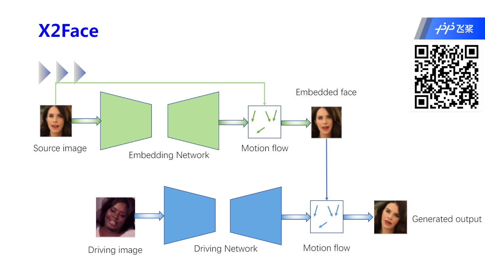
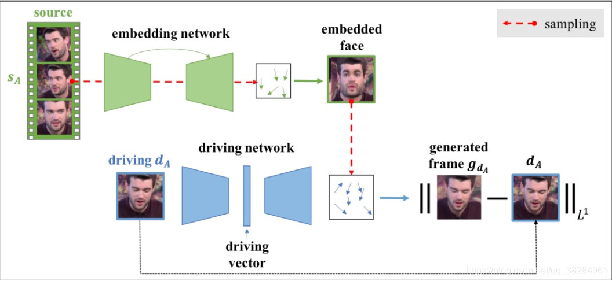
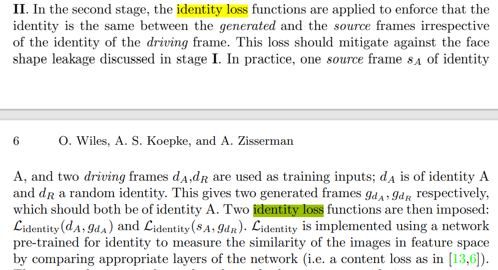
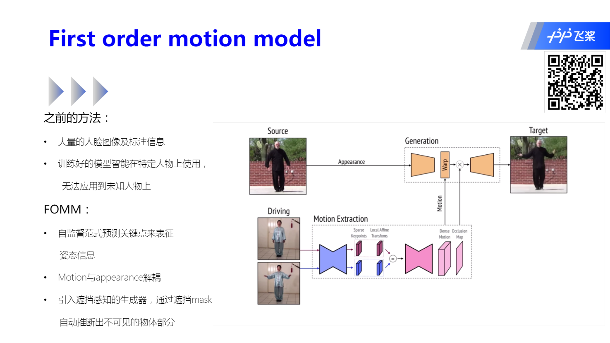
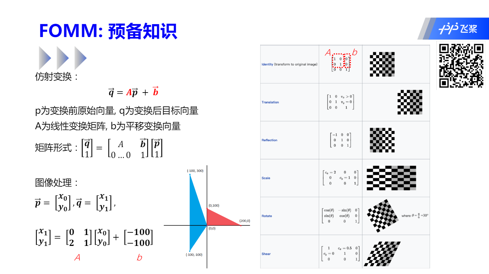
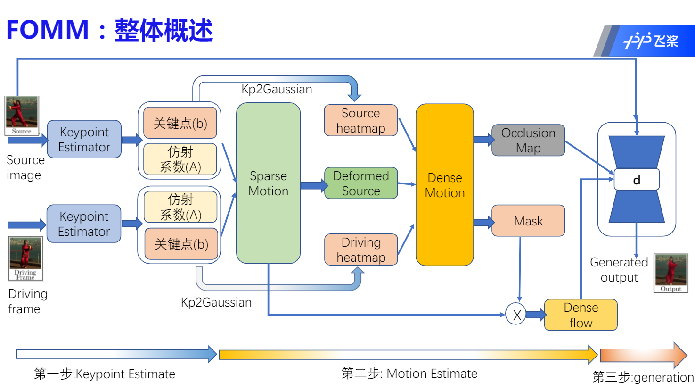
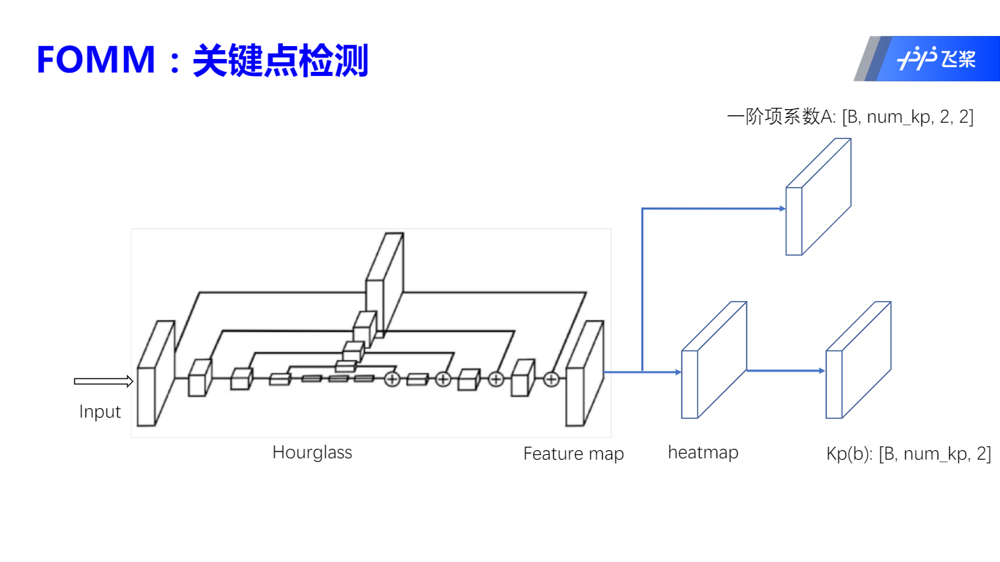

# 动作迁移理论及实践

## 前言： X2Face

在理解这节课的主要模型 [FOMM][] 之前，老师简单介绍了下 [X2Face][]

但是因为相关知识较少，实在没有理解老师提到的关于 Motion flow 的具体含义，所以找了下相关资料参考了下

>网络实在自监督的条件下训练的，这些画面源图片和驱动图片是一对一的，这些画面通过两个子网络，第一个网络是embedding网络，第二个网络是驱动网络，通过控制网络信息的流动，embedding网络，学习源脸部嵌入人脸表达，驱动网络学习如何结合驱动向量以及embedding网络的面部表达，来生成图像对应图像。
>————————————————
>版权声明：本文为CSDN博主「Walter Wu」的原创文章，遵循CC 4.0 BY-SA版权协议，转载请附上原文出处链接及本声明。
>原文链接：https://blog.csdn.net/qq_38284961/article/details/102475968

文中给出了网络结构图，和上课展示的略有不同

[X2Face][] 训练分为两个截断

**阶段一**

- 阶段一训练阶段是全自监督训练
- 主要是生成图片与驱动图片的 L1 loss, 但是在训练的时候我们发现，生成的人的脸型与驱动图片有很多类似，所以在下一阶段需要加入另一个 Loss Function

**阶段二**

根据驱动图像以及源图像的相似性来微调第一步训练的模型，其中提到 identity loss，没有很好的理解，论文中是这么提到的

> $L_{identity}$ is implemented using a network pre-trained for identity to measure the similarity of the images in feature space by comparing appropriate layers of the network 

关于 content loss，可以看这里

-  https://zhuanlan.zhihu.com/p/31566648
- https://zhuanlan.zhihu.com/p/49433020

实际上非常好理解，拿 VGG 举例，一个 VGG 分类器，中间层我们认为是可以提取到图像的内容特征的，拿 source image 和 driving image 同时传入这个 VGG 网络，计算两个不同图片在 该分类器 的中间层的 L2 loss，就是其 content loss。

其中还提到了 

photometric L1 loss 没有很好理解，也没有找到相关资料

具体实现还要看下代码实现再给出具体描述

**Motion flow**

其中关于 Motion flow

> embedding network. The embedding network learns a bilinear sampler to determine how to map from the source frame to a face representation, the embedded face. The architecture is based on U-Net [32] and pix2pix [15]; the output is a 2-channel image (of the same dimensions as the source frame) that encodes the flow δx, δy for each pixel.

\# 我又把视频看了一遍，感觉自己能理解了，后面抽空按照老师授课内容和论文把这块写一下

> 待补充

## 正文：FOMM

上面是 FOMM 整体概述，然后关于 Keypoint Estimator，我们使用 Hourglass 网络结构来提取特征

Hourglass 经常用来作为关键点检测的骨干网络，比如人脸关键点、骨骼关键点等

[FOMM]: https://arxiv.org/abs/2003.00196	"First Order Motion Model for Image Animation"
[X2Face]: https://arxiv.org/abs/1807.10550	"X2Face: A network for controlling face generation by using images, audio, and pose codes"

