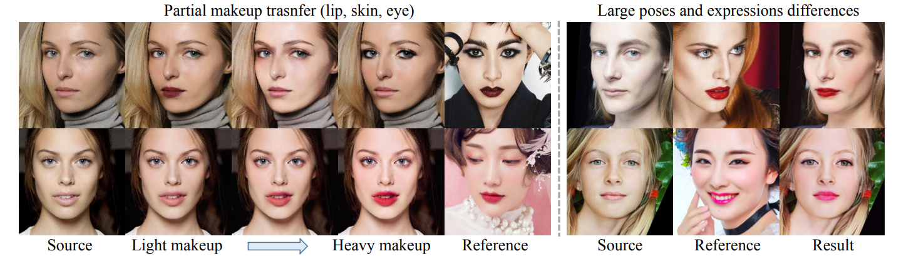

# PS-GAN

**导读：** 

[论文解读 | 美人秀色空绝世，我用PS-GAN试伊妆](https://posts.careerengine.us/p/5dd74fa47c5a95263e2d8ab7)

[基于PaddleGAN的PSGAN模型一键妆容迁移](https://aistudio.baidu.com/aistudio/projectdetail/1841558)

论文效果图👇

PSGAN 主要分为三部分：妆容提炼网络（MDNet）、注意式妆容变形（AMM）模块和卸妆-再化妆网络（DRNet）。

从上图中我们也可以得到，妆容迁移主要集中在三部分：嘴唇（lip）、皮肤（skin）以及 眼睛（eye）。